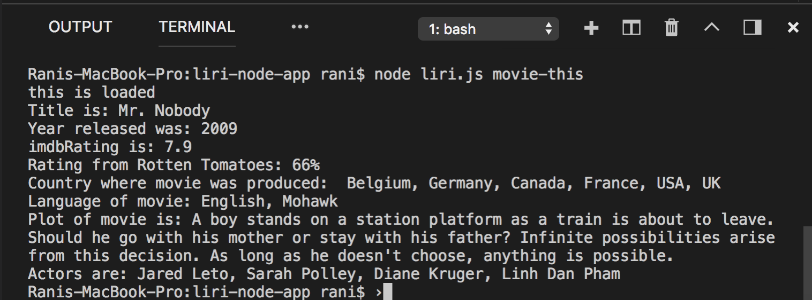
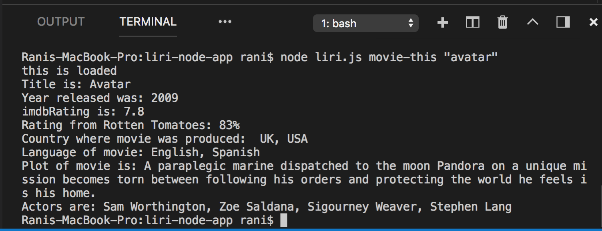
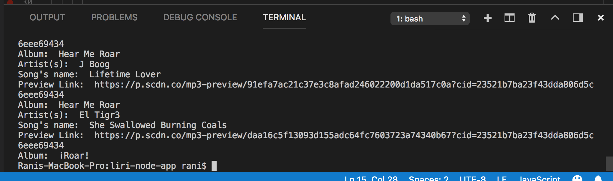
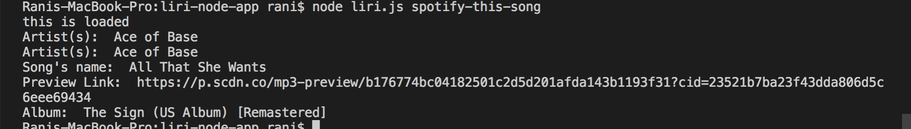

# liri-node-app

Use Node.js to create Liri,  a _Language_ Interpretation and Recognition Interface. LIRI is a command line node app that takes in parameters and gives you back data for the following:
-a song in Spotify
-a movie from OMDb
-tweets from Twitter
-a txt file 

